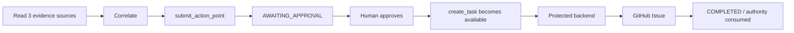
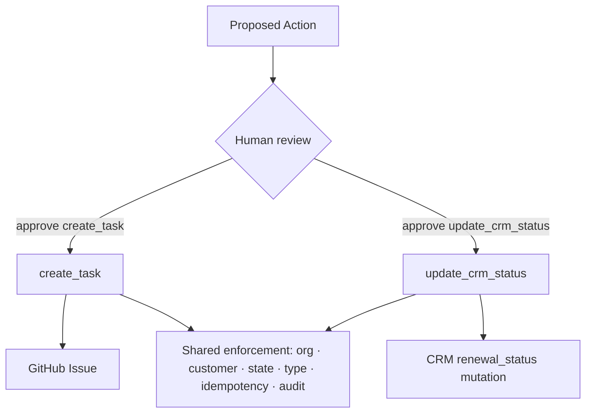

<div align="center">

# CorrelAct — Judge Acceptance Guide

**OpenAI WebMCP Challenge · Live browser test protocol**

Prove the complete CorrelAct trust model in one guided session:

**read → correlate → propose → human approval → exact capability exposed → constrained execution → audited outcome**

</div>

> [!IMPORTANT]
> **Primary judging path:** use ChatGPT's in-app browser or another WebMCP-capable browser agent. The Model Context Tool Inspector is optional and is not required to experience the product.

> [!TIP]
> If you only have a few minutes, complete **Path A — governed task creation**. It demonstrates the main WebMCP workflow, human approval boundary, Dynamic Agent Authority, real backend enforcement, and an external GitHub write. **Path B** then proves the same governance pattern generalizes to a different consequential action.

## What this guide proves

| Proof | What you should observe |
| --- | --- |
| Multi-source WebMCP investigation | The agent reads Support, CRM, and Billing evidence and correlates it into one recommendation. |
| Proposal is not execution | `submit_action_point` creates a reviewable Proposed Action but performs no consequential write. |
| Human approval is a real gate | A run must reach `APPROVED` before any write capability can act on it. |
| Dynamic Agent Authority | Controlled write tools are registered on the Tasks page only while matching approved work exists. |
| Exact capability binding | A run approved for `create_task` cannot silently execute `update_crm_status`, and vice versa. |
| Server-enforced scope | Organization, customer, approval state, execution type, stale state, and idempotency are revalidated by protected backend routes. |
| Two governed write paths | The same approval model governs a GitHub Issue creation and a PostgreSQL-backed CRM status mutation. |
| Auditability | Evidence, proposal, human decision, execution, and outcome remain visible in CorrelAct Runs / Traces. |

## Before you begin

Use the live CorrelAct deployment supplied with the challenge submission. The production route layout is:

| Surface | Route | Purpose |
| --- | --- | --- |
| Public project page | `/` | Product overview |
| CorrelAct application | `/app` | Dashboard, Approvals, Runs, Traces, Evals |
| Investigation | `/investigation/` | Multi-source WebMCP investigation + proposal |
| Support | `/support/` | `get_case` evidence |
| CRM | `/crm/` | `get_customer` application-backed evidence |
| Billing | `/billing/` | `get_invoice` evidence |
| Tasks | `/tasks/` | Dynamically exposed approved write capabilities |

Authentication is shared across the workspaces through the same browser session. **Sign in once and remain signed in while moving between routes.**

### Reference identities

| Organization | Demo user | Reference customer | Canonical CRM baseline |
| --- | --- | --- | --- |
| **NorthStar** | `user@northstar.com` | **ACME** | `renewal_status = blocked` |
| **Neptune** | `user@neptune.com` | **GreenMart** | `renewal_status = normal` |
| Both | `admin@correlact.com` | Both | Platform administration |

Passwords are supplied separately with the challenge credentials and are never committed to this repository.

## Architecture note — evidence sources are intentionally different

CorrelAct is explicit about the implementation depth of each source. This matters when evaluating what is a WebMCP demonstration fixture versus what is protected application state.

| Capability | Data path | Persistence / authority |
| --- | --- | --- |
| `get_case` | Browser-local deterministic Support reference dataset | Read-only demo evidence; no `/support/*` backend API |
| `get_customer` | WebMCP → protected FastAPI CRM endpoint → PostgreSQL | Real application-backed customer state |
| `get_invoice` | Browser-local deterministic Billing reference dataset | Read-only demo evidence; no `/billing/*` backend API |
| `submit_action_point` | WebMCP → protected FastAPI → PostgreSQL | Persists the proposal and evidence for human review |
| `create_task` | WebMCP → `/webmcp/tasks` → protected execution boundary → GitHub | Real external consequential write |
| `update_crm_status` | WebMCP → `/webmcp/crm-status` → protected execution boundary → PostgreSQL | Real consequential CRM mutation |

Support and Billing are deliberately deterministic browser-native reference systems so a judge can reproduce the same correlation scenario every time. **The consequential trust claims are not delegated to those browser fixtures:** proposal persistence, approval state, CRM state, GitHub execution, execution-type enforcement, customer/organization scope, and idempotency are enforced by the backend.

---

# Path A — Governed task creation

**Recommended primary test · NorthStar / ACME · `create_task`**



## A1. Sign in

Open `/app` and sign in with the **NorthStar** challenge credentials.

**Pass condition**

- CorrelAct opens successfully.
- The active organization is **NorthStar**.
- The same authenticated session is available when you open `/investigation/`, `/crm/`, `/support/`, `/billing/`, and `/tasks/`.

## A2. Observe the pre-approval authority baseline

Before creating any new approved work, open `/tasks/`.

The Dynamic Agent Authority panel should show that read/propose capability exists elsewhere, while consequential execution is locked unless the organization currently has approved executable work.

**Pass condition**

- `create_task` is not advertised merely because the user is authenticated.
- `update_crm_status` is not advertised merely because the user is authenticated.
- If another previously approved run is still pending, the page may expose its matching tool; tool registration reflects the **current approved queue**, not permanent standing authority.

## A3. Run the multi-source investigation

Open `/investigation/` in the same WebMCP-capable browser session and give the agent this prompt:

```text
Investigate the ACME renewal issue for the NorthStar organization.
Use Support, CRM, and Billing tools to gather evidence and determine the most likely cause.
Then use submit_action_point to persist one focused recommended action for human review.
Bind create_task as the execution capability.
You may submit the proposal, but do not execute any external write action.
```

**Expected WebMCP tools**

| Tool | Expected role |
| --- | --- |
| `get_case` | Verify the customer-reported Support issue and escalation context |
| `get_customer` | Verify ACME's real CRM account / renewal state |
| `get_invoice` | Verify the invoice variance, dispute state, and renewal hold |
| `submit_action_point` | Persist one evidence-grounded Proposed Action for review |

**Pass condition**

- The agent uses evidence from all three sources rather than inventing customer facts.
- One Proposed Action is persisted for **ACME / NorthStar**.
- The run is `AWAITING_APPROVAL`.
- The Proposed Action is bound to `create_task`.
- **No GitHub issue has been created yet.**

> [!NOTE]
> This is the first key boundary: the agent may investigate and propose autonomously, but `submit_action_point` does not grant or perform the consequential write.

## A4. Perform the human review

Open `/app` → **Approvals** and select the new ACME run.

Review the evidence, recommendation, customer, organization, and execution capability before approving.

**You should see**

```text
Execution Capability: create_task
```

Approve the Proposed Action.

**Pass condition**

- The run moves from `AWAITING_APPROVAL` to `APPROVED`.
- Approval records the human decision.
- **Approval itself does not create a GitHub issue.**

## A5. Verify Dynamic Agent Authority

Return to `/tasks/` and refresh if necessary.

**Pass condition**

- `create_task` is now available because matching approved work exists for NorthStar.
- The approved run is visible as executable work.
- The tool accepts only `run_id`, `tenant_id`, and the evidence-bound `customer_name`; it cannot rewrite the reviewed priority, team, description, or execution type.

This is stronger than a permanently exposed write tool that merely fails later. CorrelAct changes the browser agent's available capability set as human approval state changes.

## A6. Execute the approved task

Copy the full approved run ID and ask the browser agent:

```text
Execute the already-approved ACME task for run RUN_ID in the NorthStar organization.
Use create_task.
Do not alter the approved action or create any additional work.
```

**Pass condition**

- `create_task` executes the already-reviewed scope.
- A real GitHub Issue is created.
- The run becomes `COMPLETED`.
- The execution result is persisted in CorrelAct.

## A7. Verify authority consumption and audit trail

Refresh `/tasks/` after completion, then inspect `/app` → **Traces** or **Runs**.

**Pass condition**

- The completed run is no longer executable.
- If no other NorthStar `create_task` run remains approved, the `create_task` WebMCP tool is removed from the Tasks page.
- The trace shows the progression from evidence → proposal → human decision → agent write → outcome.

> [!NOTE]
> Backend idempotency is also covered by automated abuse tests. In the live browser flow, authority consumption may remove the tool immediately after completion, so judges are not required to force a duplicate browser invocation simply to prove retry safety.

---

# Path B — Second governed write proof

**Recommended second test · `update_crm_status`**

The purpose of Path B is not just to perform another action. It proves that CorrelAct's approval boundary is **reusable across differently-shaped consequential writes**.



## B1. Confirm a usable CRM baseline

Open `/crm/` and read the current customer state before submitting the second proposal.

Preferred scenario:

```text
NorthStar / ACME
renewal_status = blocked
approved transition = blocked → escalation_open
```

Fallback scenario:

```text
Neptune / GreenMart
renewal_status = normal
approved transition = normal → follow_up_required
```

> [!WARNING]
> The CRM write is intentionally persistent. If a previous judge has already consumed ACME's `blocked → escalation_open` transition, do not try to force the old expected state. Use the GreenMart fallback if its canonical `normal` state is still available, or inspect the completed CRM execution in Runs / Traces. Rejecting stale state is part of the security model, not a demo failure.

## B2. Submit a CRM-bound Proposed Action

For the preferred ACME scenario, open `/investigation/` and use:

```text
Investigate the ACME renewal issue for the NorthStar organization using Support, CRM, and Billing evidence.
Submit one focused Proposed Action for human review.
Bind update_crm_status as the execution capability with this exact approved scope:
renewal_status blocked → escalation_open.
Do not execute the CRM mutation before human approval.
```

The bound execution metadata is equivalent to:

```text
execution.type = update_crm_status
execution.crm_expected_status = blocked
execution.crm_target_status = escalation_open
```

**Pass condition**

- A fresh Proposed Action is persisted in `AWAITING_APPROVAL`.
- The exact transition is frozen before review.
- CRM still shows the original status; submitting the proposal did not mutate it.

## B3. Review the exact CRM scope

Open `/app` → **Approvals**.

Before approving, the reviewer should be able to verify:

```text
Execution Capability: update_crm_status
Approved Execution Scope: renewal_status: blocked → escalation_open
```

Approve the run.

**Pass condition**

- The run becomes `APPROVED`.
- **CRM still has not changed.** Approval is authorization, not execution.

## B4. Execute only the approved CRM transition

Open `/tasks/` and use the full approved run ID:

```text
Execute the already-approved CRM status update for run RUN_ID in the NorthStar organization using update_crm_status.
Use ACME as the evidence-bound customer.
Do not change the approved customer or status transition.
```

**Pass condition**

- `update_crm_status` executes through its own protected backend route.
- ACME changes from `blocked` to `escalation_open`.
- The run becomes `COMPLETED`.
- The browser tool could not supply a different target status at execution time because the transition was frozen in the approved Proposed Action.

## B5. Verify persisted state and consumed authority

Return to `/crm/`, then `/tasks/`, and finally `/app` → **Traces**.

**Pass condition**

- CRM returns the new persisted renewal status.
- The completed run is no longer executable.
- If no other approved CRM-status work exists, `update_crm_status` disappears from the Tasks WebMCP capability set.
- The trace retains the approved scope and execution outcome.

---

# Optional trust-boundary checks

These are useful for judges who want to test the security model beyond the happy path. They are **not required** to understand the core product.

| Check | How to test | Expected result |
| --- | --- | --- |
| Pre-approval write | Open Tasks before approving a fresh run | Matching write capability is not exposed for that unapproved work |
| Wrong capability | Attempt to use `update_crm_status` for a run approved as `create_task`, or vice versa | Rejected / not available for that run |
| Customer mismatch | Supply a different customer name when executing an approved run | Rejected because customer does not match the run's CRM evidence |
| Organization mismatch | With an identity that can see both organizations, supply the wrong organization for an approved run | Rejected because the run belongs to a different organization |
| Stale CRM state | Try executing a CRM approval whose expected status is no longer current | Rejected; a fresh investigation / review is required |
| Authority consumption | Complete a run and refresh Tasks | Completed work is no longer executable; tool exposure recomputes from remaining approved work |
| Duplicate safety | Covered by backend automated tests and durable execution records | Repeated execution cannot create a second consequential outcome |

A previously verified live negative path used a Neptune / GreenMart approval, then deliberately tried the wrong customer and wrong organization before executing the correct scoped request. Both mismatches were rejected; the correctly scoped execution succeeded.

# Acceptance checklist

A complete live session should make the following observable:

- [ ] Authentication works and persists across workspaces.
- [ ] `get_case` returns Support evidence.
- [ ] `get_customer` returns PostgreSQL-backed CRM evidence.
- [ ] `get_invoice` returns Billing evidence.
- [ ] The agent correlates evidence across all three sources.
- [ ] `submit_action_point` creates a Proposed Action without a consequential write.
- [ ] Unapproved work has no executable write authority.
- [ ] Human approval moves the run to `APPROVED` without executing it.
- [ ] Matching WebMCP write authority appears dynamically after approval.
- [ ] `create_task` creates exactly the approved GitHub task.
- [ ] `update_crm_status` can execute a separately approved CRM transition.
- [ ] Customer / organization / execution-type mismatches are rejected.
- [ ] Completed authority is consumed.
- [ ] CRM state persists after the approved mutation.
- [ ] Runs / Traces preserve the evidence, decision, write, and outcome.

## What not to infer from the demo

- Support and Billing are **not** claimed to be production database integrations. They are deterministic browser-local reference evidence sources created to make the WebMCP correlation scenario reproducible.
- CRM **is** application-backed and PostgreSQL-persisted.
- The two consequential writes are **not** browser-only simulations: each reaches an independently enforced backend route.
- The presence of a WebMCP tool in the browser is **not** itself authorization. The backend remains authoritative even after the browser exposes the capability.

## Manual developer verification — optional

The Model Context Tool Inspector may be used to inspect tool registration, schemas, inputs, and results. It is useful for debugging, but it is not part of the primary judging experience and is not required to validate CorrelAct's live workflow.

---

<div align="center">

### CorrelAct's core claim

**Same governed boundary. Different consequential action.**  
**The agent receives only the capability the human approved.**

See the project overview in [`README.md`](../README.md) and the controlled-execution architecture in [`docs/unified-controlled-execution.md`](unified-controlled-execution.md).

</div>
