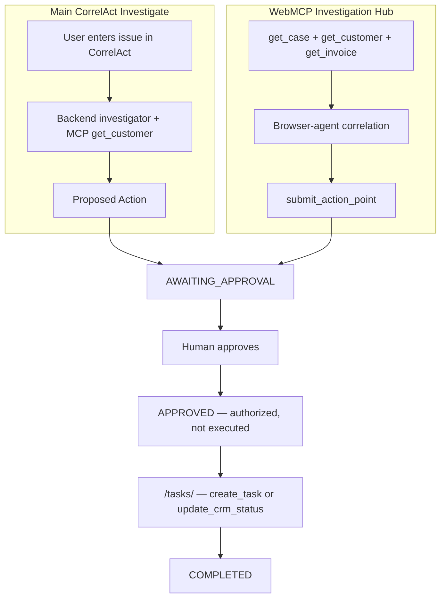
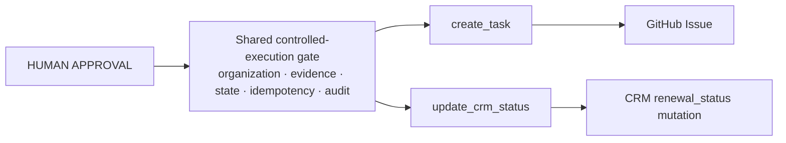

# Unified controlled execution

CorrelAct uses one human-control model for every Proposed Action, regardless of which investigation path created it or which of the two consequential write tools it's bound to.

## Two investigation paths converge on one gate

The investigation mechanisms are still different: the main CorrelAct page uses the existing backend OpenAI investigator and the `get_customer` MCP tool, while `/investigation/` is the browser-agent/WebMCP surface. Their approval and consequential-execution semantics are identical — `agent_lab/webmcp_tasks.py` is the single controlled approval/execution boundary for every Proposed Action that requires human approval, regardless of which path produced it.

## Two consequential write tools, same boundary

A Proposed Action can be bound to either of two independently enforced write tools:

`create_task` and `update_crm_status` each have their own backend route (`/webmcp/tasks` and `/webmcp/crm-status`) so a tool can never dispatch the other execution type, even if a client-side check were bypassed entirely — see [`docs/webmcp-tasks.md`](webmcp-tasks.md) for the exact server-side checks each route performs.

A human approval means **authorized**, not **already executed**. The run stays `APPROVED` until one of these two routes is invoked, and the Tasks workspace lists every executable approved Proposed Action, not only WebMCP-submitted ones.

## Customer scope binding

Both execution routes accept only:

- `run_id`
- `tenant_id`
- `customer_name`

The server binds `customer_name` to investigation evidence:

- WebMCP runs: the explicit `WebMCP crm evidence attached` trace.
- Main CorrelAct runs: the persisted `get_customer result received` MCP trace.

The browser cannot replace the approved description, priority, target team, customer, or (for `update_crm_status`) the reviewed status transition with a different scope.

## Safety properties retained by both write paths

- human approval required before either write;
- organization boundary enforced;
- customer evidence mismatch rejected;
- approved action scope loaded server-side, never trusted from the browser;
- stale CRM state rejected (`update_crm_status` only) — the customer's current `renewal_status` must still match what was approved;
- durable idempotency prevents duplicate GitHub issues or duplicate CRM mutations;
- evidence remains separate from execution outcome.

**Same governed boundary. Different consequential action. The agent receives only the capability the human approved.**
